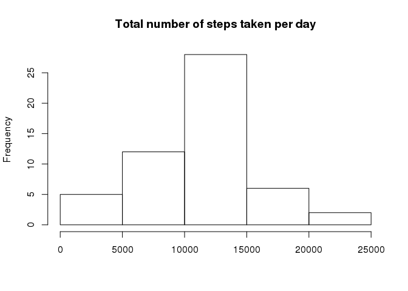
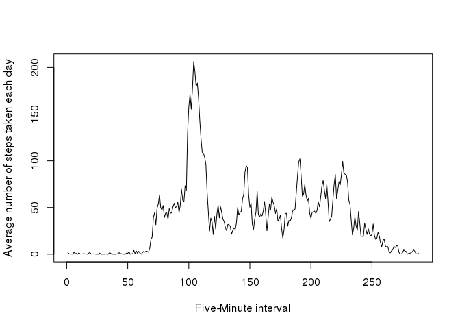
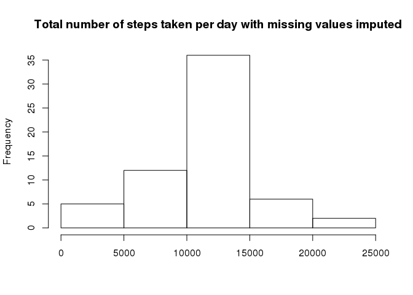
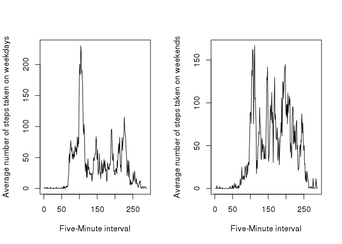

Course Project 1
================

We first download, extract and load the dataset in R

```r
temp <- tempfile()
fileUrl <- "https://d396qusza40orc.cloudfront.net/repdata%2Fdata%2Factivity.zip"
download.file(fileUrl, temp)
con <- unz(temp, "activity.csv")
activity <- read.csv(con, header = TRUE)
unlink(temp)
```

Let's calculate the total number of steps taken per day and plot a histogram.


```r
dailySum <- aggregate(steps ~ date, activity, sum)
hist(dailySum$steps, main = "Total number of steps taken per day", xlab="")
```

<!-- -->

Here's the mean of the total number of steps taken per day.


```r
mean(dailySum$steps)
```

```
## [1] 10766.19
```

Here's the median of the total number of steps taken per day.


```r
median(dailySum$steps)
```

```
## [1] 10765
```

We create a matrix with intervals as columns and dates as rows.

```r
activityMatrix <- with(activity, tapply(steps, list(Date = date, Interval = as.factor(interval)), sum))
```

Here we create the intervals for the x-axis of the time series plot.

```r
uniqueIntervals <- unique(activity$interval)
```

We calculate the average number of steps taken per day per interval.

```r
dailyStepsInt <- colMeans(activityMatrix, na.rm = TRUE)
```

Here's the time series plot of the average number of steps taken averaged across all days.

```r
plot(1:length(uniqueIntervals), dailyStepsInt, type = "l", ylab = "Average number of steps taken each day", xlab = "Five-Minute interval")
```

<!-- -->

We see here that the 104th 5-minute interval contains the maximum number of steps on average across all the days in the dataset.

```r
which(dailyStepsInt == max(dailyStepsInt))
```

```
## 835 
## 104
```

We impute missing values using the mean for the respective 5-minute interval.

```r
intervalMeans <- colMeans(activityMatrix, na.rm = TRUE)

for (i in 1:nrow(activityMatrix)){
    for(j in 1:ncol(activityMatrix)){
        if(is.na(activityMatrix[i, j])){
            activityMatrix[i,j] = intervalMeans[j]  
        } 
    }
}
```

Let's calculate the total number of steps taken each day after imputing missing values and make a histogram.

```r
dailySumNew <- rowSums(activityMatrix)
hist(dailySumNew, main = "Total number of steps taken per day with missing values imputed", xlab = "")
```

<!-- -->

Here's the mean of the total number of steps taken each day after imputing missing values.

```r
mean(dailySumNew)
```

```
## [1] 10766.19
```

Here's the median.

```r
median(dailySumNew)
```

```
## [1] 10766.19
```

Clearly imputing missing values does not significantly change the estimates of the total daily number of steps.

Here, we subset our matrix separately for weekdays and weekends 

```r
weekdates <- character()
for(i in 1:nrow(activityMatrix)){
    weekdates[i] <- weekdays(as.Date(rownames(activityMatrix)[i]))
}

weekdates1 <- c("Monday", "Tuesday", "Wednesday", "Thursday", "Friday")

columnNames <- colnames(activityMatrix)

actWday <- subset(activityMatrix, weekdates %in% weekdates1)
actWnd <- subset(activityMatrix, !(weekdates %in% weekdates1))

dim(actWday)
```

```
## [1]  45 288
```

```r
dim(actWnd)
```

```
## [1]  16 288
```

```r
actWday <- mapply(actWday, FUN = as.numeric)
actWnd <- mapply(actWnd, FUN = as.numeric)

actWday <- matrix(actWday, ncol = 288, nrow = 45)

actWnd <- matrix(actWnd, ncol = 288, nrow = 16)

colnames(actWday) <- columnNames
colnames(actWnd) <- columnNames
```

Finally, we have a panel plot containing time series plot of the average number of steps taken, averaged over all weekdays and weekends.

```r
par(mfrow = c(1,2))
plot(1:length(uniqueIntervals), colMeans(actWday), type = "l", ylab = "Average number of steps taken on weekdays", xlab = "Five-Minute interval")
plot(1:length(uniqueIntervals), colMeans(actWnd), type = "l", ylab = "Average number of steps taken on weekends", xlab = "Five-Minute interval")
```

<!-- -->
